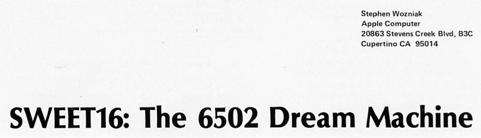
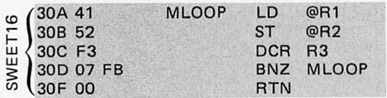

# WOZNIAK'S SWEET16



**SWEET16** is an interpreted bytecode instruction set created by **Steve Wozniak** for the **6502** microprocessor.

It is a very easy to learn architecture for experimenting with low-level programming.

This repository uses C# 10.0 on NET 6.0 to implement from scratch :

- An **assembler** to create SWEET16 bytecode
- A **virtual machine** to run the compiled bytecode
- A **unit test** for debugging purposes

For reference, the original **BYTE Magazine (November 1977)** article is available in the attached [SWEET16.PDF](SWEET16.PDF) file.

**Note:**\
The retrieved documentation contains some errors, see the [Errata](#errata) section for more details. 

## Assembler

To invoke the assebler use : `SWEET.EXE -b srcfile dstfile` where :

`-b` indicate build mode\
`srcfile` is the assembly source file\
`dstfile` is the generated bytecode file

- The `ORG addr` macro set the `addr` parameter as entry point ( default **0x0000** )
- The `FILL count` macro fill the following `count` bytes with `0x00`
- Macros, instructions, labels and registers must be in uppercase
- Label declarations must end with a colon symbol `:`
- For hexadecimal values the prefix is `0x`
- The separator `,` between elements is not mandatory
- Comments starts with `*` asterisk symbol
- Arithmetic expressions are not supported

## Virtual machine

To invoke the virtual machine use : `SWEET.EXE -e entry binfile` where :

`-e` indicate execution mode\
`entry` is the address where the bytecode will be loaded\
`binfile` is the bytecode to be loaded

- The virtual machine has **16K bytes** of addressable memory
- At startup, the program counter is set to the provided `entry` address, all other registers will be initialized to **0x0000**
- The virtual machine uses **little-endian** format
- Hardware/software interrupts are **not** supported
 
## Instructions set

**Registers usage**

| Number | Use |
| ------ | ----------- |
| (R0)	| Accumulator |
| (R12) | Subroutines return |
| (R13) | Branch comparator |
| (R14) | Carry flag |
| (R15) | Program counter |

**Non Reg Ops**

| Opcode | Mnemonic | Description |
| ------ | -------- | ----------- |
| 00 | RTN | Return to 6502 mode(1) |
| 01 | BR ea | Branch always |
| 02 | BNC ea | Branch if no carry |
| 03 | BC ea | Branch if carry |
| 04 | BP ea | Branch if plus |
| 05 | BM ea | Branch if minus |
| 06 | BZ ea | Branch if zero |
| 07 | BNZ ea | Branch if non zero | 
| 08 | BM1 ea | Branch if -1 |
| 09 | BNM1 ea | Branch if not - 1 |
| 0A | BK ea | Break(2) |
| 0B | RS | Return from subroutine |
| 0C | BS ea | Branch to subroutine |
| 0D | | Unused |
| 0E | | Unused |
| 0F | | Unused |

**ea** = displacement address (-128 to +127)\
**(1)** = terminate the virtual machine\
**(2)** = will print on stdout the content of all registers

**Reg Ops**

| Opcode | Mnemonic | Description |
| ------ | -------- | ----------- |
| 1n | SET Rn const | Set | 
| 2n | LD Rn | Load |
| 3n | ST Rn | Store |
| 4n | LD @Rn | Load indirect |
| 5n | ST @Rn | Store indirect |
| 6n | LDD @Rn | Load double indirect |
| 7n | STD @Rn | Store double indirect |
| 8n | POP @Rn | Pop indirect |
| 9n | STP @Rn |Store pop indirect | 
| An | ADD Rn | Add |
| Bn | SUB Rn | Sub |
| Cn | POPD @Rn | Pop double indirect | 
| Dn | CPR Rn | Compare | 
| En | INR Rn | Increment | 
| Fn | DCR Rn | Decrement |

**@** = register indirect\
**n** = register index\
**const** = 2 bytes constant

## Example

The original paper code :



can be written as :

 ```
        ORG 0x030A
 MLOOP: LD @R1
        ST @R2
        DCR R3
        BNZ MLOOP
        RTN
```

and will be assembled as :

`0x41, 0x52, 0xF3, 0x07, 0xFB, 0x00`

**NOTE:** R1,R2 and R3 should be set to some known value

## Errata

- **PAGE 156** : In the example of the POP function the opcodes values for indirect store are wrong, 0x35 opcodes should be instead 0x55 

- **PAGE 156** : The description of the STP function is wrong, the byte at 0xA033 will be moved at 0x9021, the byte at 0xA032 will be moved at 0x901F

- **PAGE 156** : The description of the SUB operation is misleading, the CF flag should be set only if ACC is "strictly" greater then RN.\
Also the opcodes of the SUB function are wrong, 0xA0 opcode should 0xB0, 0xA1 opcode should be 0xB1 .

- **PAGE 159** : In the section of the BS function the location of the MOVE routine at 320 is wrong, the correct address is 332.
        
## Reference

Wikipedia :\
https://en.wikipedia.org/wiki/SWEET16

Internet Archive :\
https://archive.org/details/BYTE_Vol_02-11_1977-11_Sweet_16/page/n151